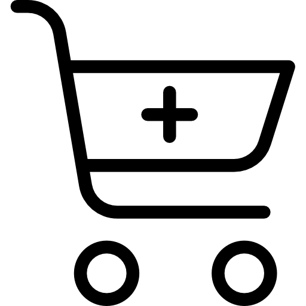
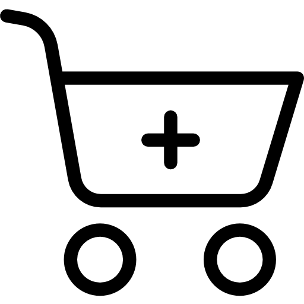

# Shopping Icons for React Native

### react-native-ico-shopping

288 Vector Icons for React Native

  

## List of icons

- [List of Shopping Icons](http://ico.simpleness.org/pack/shopping)

## Usage

```
import Icon from 'react-native-ico-shopping';


// Inside some view component
render() {
    return (
        <>
          <Icon name="invoice" />
          <Icon name="shopping-cart" height="40" width="40" />
          <Icon name="shopping-cart-1" color="red" />
          <Icon name="shopping-cart" badge="10" />
          <Icon name="shopping-cart" badge={{value: 'A', fontSize: 25, radius: 22, position:'top_left', color:'orange', backgroundColor:'blue'}}/>
          <Icon name="invoice" background="circle" />
          <Icon name="invoice" background={{ type: "button", color: 'green' }} />
        </>
    );
}

```

## Installation

#### yarn

```bash
yarn add react-native-ico-shopping react-native-svg
```

#### npm

```bash
npm install --save react-native-ico-shopping react-native-svg
```

### Link react-native-svg

```bash
react-native link react-native-svg
```

### pod install ( for iOS )

```
cd ios && pod install && cd ..
```

## API

### <Icon name [color width height background badge ...rest] />

Returns a SvgXml icon by name and group.

 name | optional | default value | description | examples
------|----------|---------------|-------------|---------
name | no |  | name of icon | "invoice"
color | yes | | line color, css style | "#00ff00", "#0f0", "green"
width | yes | 20 | width of the icon | 40
height | yes | 20 | height of the icon | 40
background | no | | background type | "circle"
background | no | | background object | {type: "circle", color: 'yellow'}
badge | no | | badge string | "10"
badge | no | | badge object | {value: 'A', fontSize: 25, radius: 22, position:'top_left', color:'orange', backgroundColor:'blue'}
...rest | no | | other props | style={{backgroundColor: "#00f"}}

## Icons Made by

[Dave Gandy](https://www.flaticon.com/authors/dave-gandy)

## Created by

Dimitry Ivanov <2@ivanoff.org.ua> # curl -A cv ivanoff.org.ua
